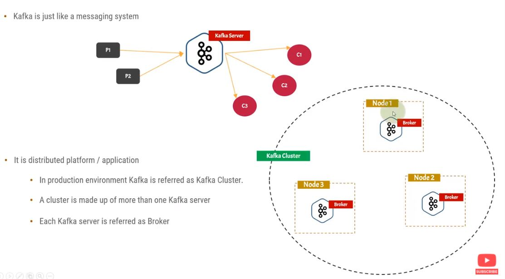
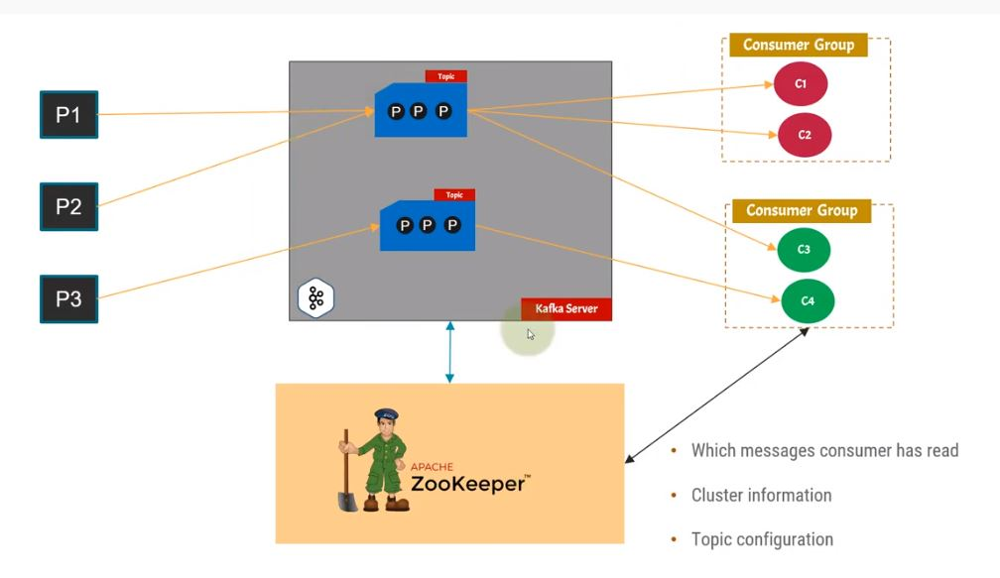

## Kafka For Beginners
[Resource on Youtube](https://youtu.be/Hl61x0s3yeQ)

### Definitions:
**1- Kafka Server:** it is the a distributed messaging application which will listen to a port we define. In production environment, Kafka is referred as Kafka cluster because there is more than one Kafka server.
**2-Producers:** Producers send messages to the Kafka server. There can be multiple producers.
**3-Consumers:** nodes that consume the data from Kafka server. A consumer cannot be by itself. It has to belong to a consumer group.
 **4-Broker:** Each Kafka server is referred to, as a broker.

Kafka is fault tolerant. which means if one or more nodes or workers or brokers fail, the system doesn't blow up and keeps working and the user doesn't experience the failure.

**Replication Factor:** Refers to the fact that a message can be saved on multiple brokers, so that if one them crashed, the others still have the same message. 
Using Kafka you can have 1 million messages per second.

**5-Events or Messages:** An event records the fact that "something happened" in the world or in your business. It is also called record or message in the documentation. 
**6-Topic:** a topic is similar to a folder in a filesystem, and the events are the files in that folder. An example topic name could be "payments".
**7-Partition:** Topics are partitioned, meaning a topic is spread over a number of "buckets" located on different Kafka brokers.
**Zookeeper:** distributed, open source configuration and synchronization service. All the configurations of the components are saved in Zookeeper.

** Setup and Installation:**
Followed the docs and installed on AWS. 

Conf file for Kafka server in named **server.properties**
Conf file for zookeeper is called **zookeeper.properties**

> Written with [StackEdit](https://stackedit.io/).