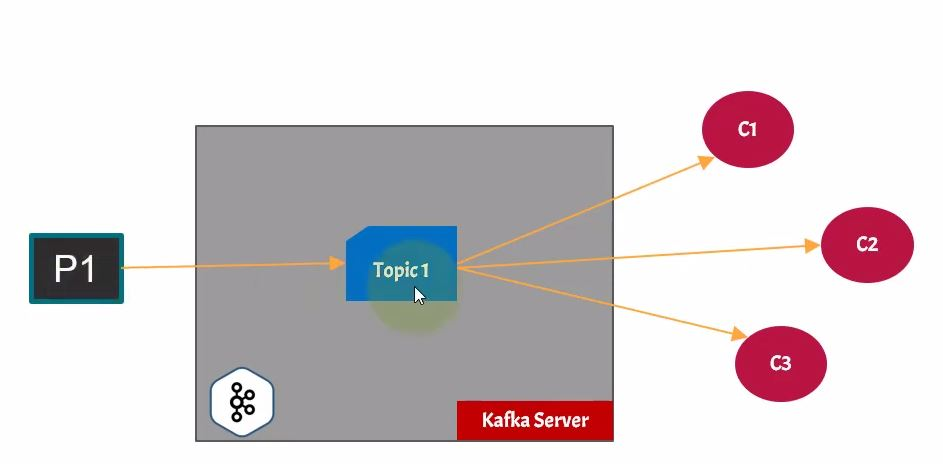
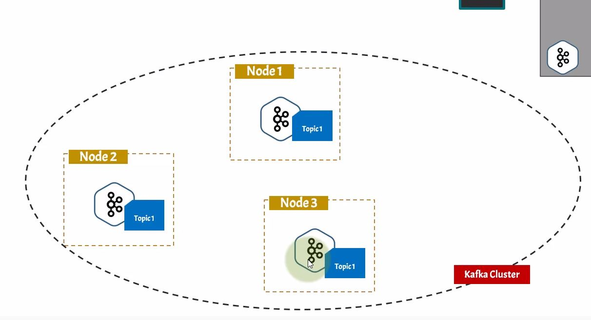
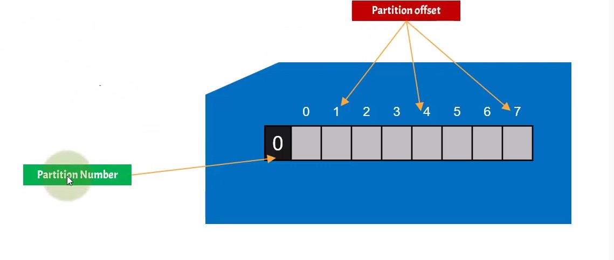
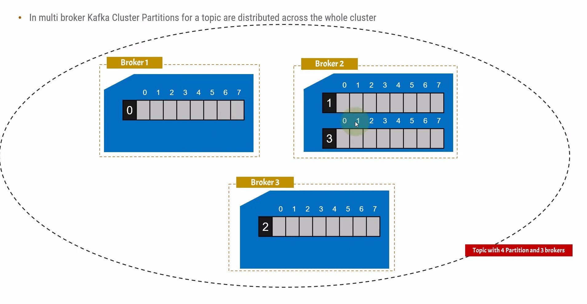
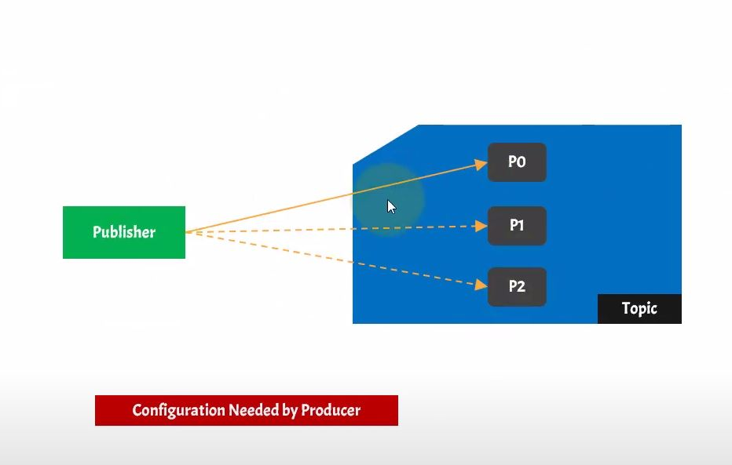
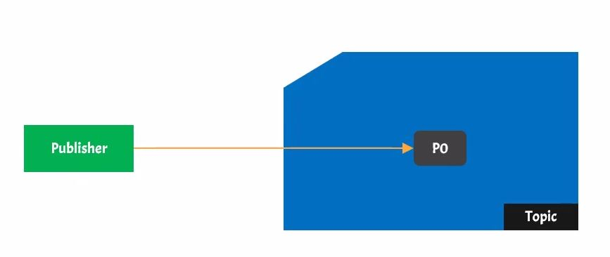
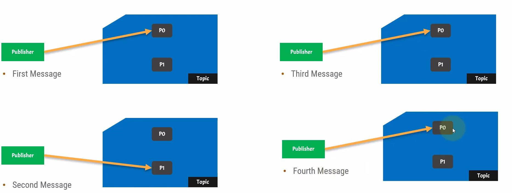
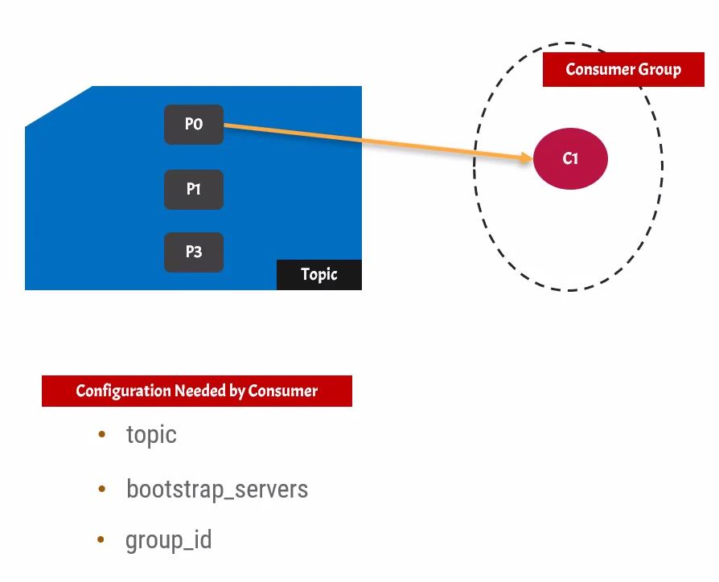

## Kafka For Beginners
[Resource on Youtube](https://youtu.be/Hl61x0s3yeQ)

### Definitions:
**1- Kafka Server:** it is the a distributed messaging application which will listen to a port we define. In production environment, Kafka is referred as Kafka cluster because there is more than one Kafka server.
**2-Producers:** Producers send messages to the Kafka server. There can be multiple producers.
**3-Consumers:** nodes that consume the data from Kafka server. A consumer cannot be by itself. It has to belong to a consumer group.
 **4-Broker:** Each Kafka server is referred to, as a broker.


Kafka is fault tolerant. which means if one or more nodes or workers or brokers fail, the system doesn't blow up and keeps working and the user doesn't experience the failure.

**Replication Factor:** Refers to the fact that a message can be saved on multiple brokers, so that if one them crashed, the others still have the same message. 
Using Kafka you can have 1 million messages per second.

**5-Events or Messages:** An event records the fact that "something happened" in the world or in your business. It is also called record or message in the documentation. 
**6-Topic:** a topic is similar to a folder in a filesystem, and the events are the files in that folder. An example topic name could be "payments".
**7-Partition:** Topics are partitioned, meaning a topic is spread over a number of "buckets" located on different Kafka brokers.
**Zookeeper:** distributed, open source configuration and synchronization service. All the configurations of the components are saved in Zookeeper.


** Setup and Installation:**
Followed the docs and installed on AWS. 

Conf file for Kafka server in named **server.properties**
Conf file for zookeeper is called **zookeeper.properties**

We need to put our server address on this like at server.properties:
```
advertised.listeners=PLAINTEXT://<server-ip>:9092
```
9092 is the default port for Kafka. The default port for Zookeeper is 2128 but we can change it in server.properties on this line:
```
zookeeper.connect=<sever-ip>:2128
```
In order to run Kafka, we always need to run Zookeeper first. Here is how we run Zookeeper after navigating to the Kafka installation folder:
```
bin/zookeeper-server-staty.sh config/zookeeper.properties
```
And after Zookeeper is connected, we can run Kafka server by running this command:
```
JMX_PORT=8004 bin/kafka-server-start.sh config/server.properties
```
Now Kafka connects to Zookeeper and they are both up and running. 

**Installing Kafka Manager:** 
Kafka manager is the graphical UI to view the Kafka cluster. 
(For now Im going to just use terminal)

>JMX_PORT=8004 is not necessary when we don't need Kafka manager.

**Kafka Topics:** Kafka topic is  and element of Kafka cluster, where the producer gets connected to, and producers publish messages in them. 
The topics in Kafka are multi subscriber which means more than one producer can connect to one topic. Also there can be more than one consumers using the data from a topic.


In Kafka cluster, each Kafka topic is present in every Kafka node.


**Kafka Partitions:**  A Kafka topic is divided into multiple part that are called Partitions. Partitions are linear data structures like arrays and data will be saved in them. Every partition has a number.

Each partition increasing index numbers called **Offsets**, and new messages will be added to the end of the partition. that's why data in partitions are immutable after being published.

In case of having a kafka cluster, partitions of a topic are distributed across the whole cluster randomly by Zookeeper. 


**Make A Producer in Python:**
A publisher or producer can send messages to any topic we want, and any partition inside the topic that we tell them to.


We need configuration for a Kafka producer. These are the necessary conf we need to define:
**1- Bootstrap Servers:** The producer needs to know the address and port number of the bootstrap server. So, the publisher can only connect to the topic if it knows the bootstrap server address.
**2-Topic:** It needs to know what topic they want to connect to.
**3- Value Serializer:** Anytime we want to send a message to our system, it should be serialized. which means it should be converted to simple string so that it could get saved in partitions. (it shouldn't be an object)

After the configuration, we write send method on producer to publish the data.
#### Example1 (One Broker, One Partition):
Let's use Python Faker library, to fake some user registration data in a single topic and single partition.

  
  - Here is how to see all the topics on Kafka cluster:
  ```
.\bin\windows\kafka-topics.bat --list --zookeeper localhost:2181
```
(Now Im running on windows that's why I navigated into windows folder, if I'm on linux I run *.sh files in the kafka root folder.

- Here is how we create a topic, with default 1 partition in it:
```
.\bin\windows\kafka-topics.bat --create --topic registered_user --bootstrap-server localhost:9092
```
We made a data generator, using python faker library which generates a user's info every 3 seconds, and made a producer which publishes the data into kafka server. In order to see the published data live, we say:
```
.\bin\windows\kafka-console-consumer.bat --bootstrap-server localhost:9092 --topic registered_user --from-beginning
```
#### Example2 (One Broker, Two Partition):
Remember the message publishing on different partitions is random.


To create a topic with two messages, here is what we write in terminal:
```
.\bin\windows\kafka-topics.bat --create --zookeeper localhost:2181 --topic user_registration_2 --replication-factor 1 --partitions 2
```
In order to see the list of partitions in a topic:
```
.\bin\windows\kafka-topics.bat --describe --zookeeper localhost:2181 --topic user_registration_2
```
The rest of the code remains the same, we just need to make more partitions, and Kafka automatically dispatches the messages to partitions randomly.

#### Example3 (One Broker, Two Partition, Send MSG Only to One Partition):
For doing this, we have the same code we had before, but we add get_partition() method. The code is in the repo.

#### Consumers and Consumer Groups:
Consumers consume messages(data) from partitions inside topics. Each consumer MUST be assigned to a consumer group. If no group_id is assigned, then random group_id will be assigned.

For creating a consumer, we need to define some configuration, like topic, bootstrap_server, and group_id. 
- Consumer groups run as separate processes. 
- consumers of a consumer group can be on different brokers or nodes of a kafka cluster.


To remove a topic:
```
.\bin\windows\kafka-topics.bat --zookeeper localhost:2181 --delete --topic user_registration_3
```


> Written with [StackEdit](https://stackedit.io/).